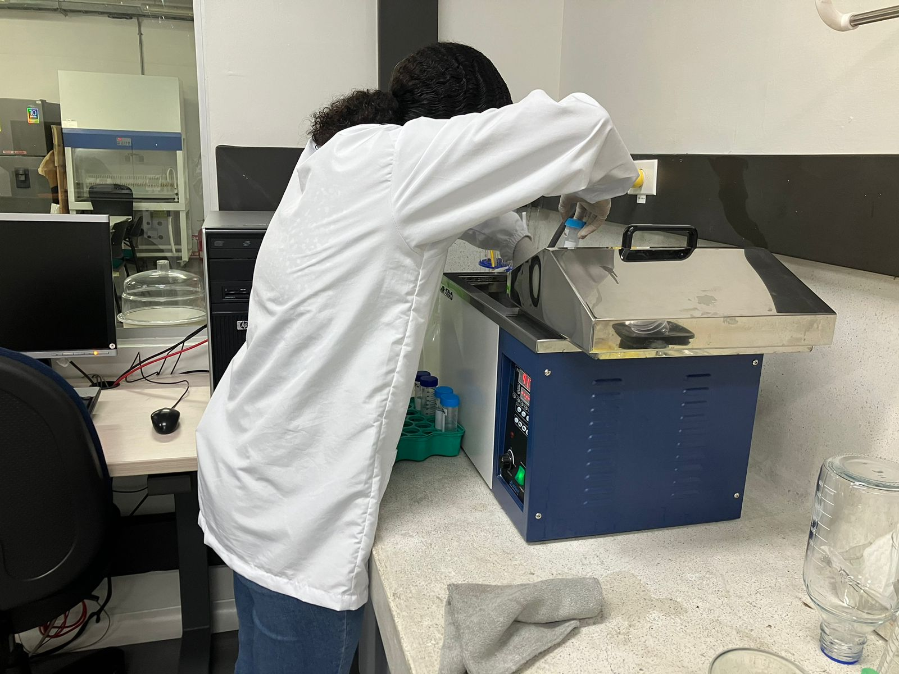

# A Simple Biological Engineering Student

<h1 align="center">Hello, I'm Sara  Valverde

  

## About Me

- 🌱 **Biological Engineering Student** at the Universidad Nacional de Colombia, graduating in June 2025.  
- 🌍 Passionate about **bioinformatics**, **data science**, and their applications in biological and food sciences.  
- 🤝 Committed to learning, teamwork, and developing sustainable and innovative solutions.  
- 🎓 Experienced in **laboratory techniques**, **food technology**, and **data analysis with Python**.  

## Work Experience

**Research Assistant**  
*Universidad Nacional de Colombia*  
*February - October 2023*  
- Coordinated administrative tasks to ensure the achievement of research project objectives.  
- Operated laboratory equipment and software tools for precise and reliable results.  
- Authored technical progress reports, facilitating project tracking and evaluation.  
- Contributed to drafting and publishing a scientific article related to project findings.  

**Laboratory Assistant**  
*Universidad Nacional de Colombia*  
*April - December 2022*  
- Conducted bibliographic research to support food processing methods.  
- Evaluated product behavior during storage, identifying improvements to extend shelf life.  
- Operated lab equipment for quality control analyses, enhancing process precision.

## Education

- **B.Sc. in Biological Engineering**, Universidad Nacional de Colombia (Expected June 2025)

## Interests

- Bioinformatics and its applications in genomics and proteomics.  
- Data science and machine learning for solving biological and engineering challenges.  
- Sustainable innovations in food technology and biotechnology.  

## Links

- 💼 [LinkedIn](https://www.linkedin.com/in/valverde-sara/)  
- 📧 [Email](mailto:valverdesara18@gmail.com)  
- 📂 [Published Article](https://www.tandfonline.com/doi/full/10.1080/10942912.2023.229346)  

